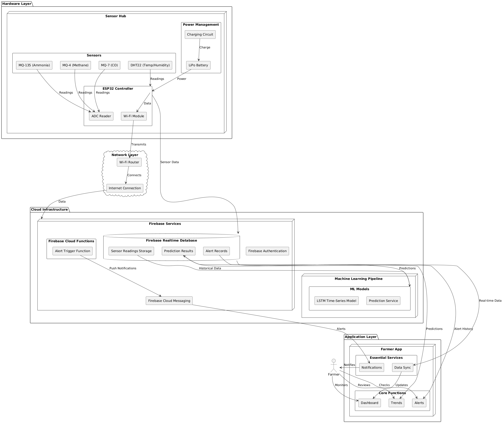

# BarnAir Monitor: Smart Cattle Farm Gas Monitoring System

This repository contains a comprehensive IoT and AI-based solution for monitoring, predicting, and alerting farmers about harmful gas emissions in cattle farms. The BarnAir Monitor system uses a network of sensors to detect methane, ammonia, and carbon monoxide levels, along with temperature and humidity data, to provide real-time monitoring and predictive analytics through an intuitive mobile application.

## Table of Contents
- [System Overview](#system-overview)
- [Key Features](#key-features)
- [Hardware Components](#hardware-components)
- [Cloud Infrastructure](#cloud-infrastructure)
- [Machine Learning Model](#machine-learning-model)
- [Mobile Application](#mobile-application)
- [Installation and Setup](#installation-and-setup)
- [Usage Guide](#usage-guide)
- [Project Structure](#project-structure)
- [Future Enhancements](#future-enhancements)
- [Troubleshooting](#troubleshooting)
- [Contributing](#contributing)
- [License](#license)

## System Overview

The BarnAir Monitor system integrates IoT sensors, cloud computing, machine learning, and mobile technology to create a comprehensive gas monitoring solution for cattle farms. The system continuously monitors harmful gases that can affect cattle health and farm safety, providing both real-time alerts and predictive insights.



### Data Flow

1. **Sensor Data Collection**: Multiple sensors deployed throughout the farm collect gas concentration readings and environmental data
2. **Data Transmission**: The ESP32 controller processes readings and transmits data to Firebase
3. **Cloud Storage & Processing**: Firebase stores the data and makes it available to the ML model and mobile app
4. **Predictive Analysis**: ML algorithms analyze historical data to predict dangerous gas level trends
5. **User Interface**: The BarnAir Monitor Flutter app displays real-time readings, alerts, and predictions to farmers

## Key Features

- **Real-time Gas Monitoring**: Continuous detection of methane (CH₄), carbon monoxide (CO), and ammonia (NH₃) levels
- **Environmental Context**: Temperature and humidity tracking to enhance gas reading accuracy
- **Predictive Alerts**: ML-powered forecasting of potentially harmful gas level spikes
- **Multi-level Alerting**: Warning and danger thresholds with visual indicators in the app
- **Historical Data Analysis**: Time-series visualization of gas trends
- **Mobile Accessibility**: User-friendly Flutter app for monitoring farm conditions
- **Offline Functionality**: Local notification alerts even without connectivity
- **Energy Efficiency**: Optional solar power and battery setup with deep sleep logic

## Hardware Components

### Sensor Hub

The heart of the monitoring system is built using the following components:

| Component | Purpose | Technical Specifications |
|-----------|---------|--------------------------|
| ESP32 | Main controller | Dual-core processor, Wi-Fi & Bluetooth connectivity |
| MQ-4 | Methane detection | 300-10,000ppm detection range |
| MQ-7 | Carbon monoxide detection | 20-2,000ppm detection range |
| MQ-135 | Ammonia & air quality | Multiple gas detection capability |
| DHT22 | Temperature & humidity | ±0.5°C, ±2-5% RH accuracy |

### Optional Components

- Solar panel (5W minimum)
- LiPo battery (3.7V, 2500mAh)
- Weatherproof enclosure (IP65 rated)
- External antenna for extended Wi-Fi range

### Wiring Diagram

The sensor hub connects all components to the ESP32 as follows:

```
ESP32 Pin Connections:
- MQ-4 (Methane): Analog pin A0, Power 5V, GND
- MQ-7 (CO): Analog pin A1, Power 5V, GND
- MQ-135 (Ammonia): Analog pin A2, Power 5V, GND
- DHT22: Digital pin D4, Power 3.3V, GND
- Optional: Battery management circuit on pins EN, 5V
```

## Cloud Infrastructure

### Firebase Configuration

The system uses Firebase services to handle authentication, data storage, and notifications:

- **Firebase Authentication**: Handles user signup and login with email/phone and OTP verification
- **Firebase Realtime Database**: Stores sensor readings and provides real-time data access
- **Firebase Cloud Messaging**: Delivers push notifications for critical alerts
- **Firebase Cloud Functions**: Processes data and triggers alerts


#### Security Rules
Firebase security rules are configured to:
- Allow reading of sensor data by authenticated users
- Restrict writing to sensors only from authenticated devices with valid farm IDs
- Allow admin access for system management

## Machine Learning Model

### Predictive Analytics

The ML component uses Long Short-Term Memory (LSTM) networks to analyze time-series data and predict future gas levels. The model is trained using historical sensor data with additional synthetic data to improve generalization.

#### Model Architecture
- Input: Sequences of CH₄, CO, NH₃, temperature, humidity, and time features
- Hidden layers: Multiple LSTM layers with dropout for regularization
- Output: Predicted gas levels for multiple future time points (1hr, 3hrs, 6hrs ahead)

#### Data Preprocessing
1. Normalization of all sensor values to 0-1 range
2. Creation of sliding windows for time-series prediction
3. Feature engineering (time of day, day of week features)
4. Handling of missing values via interpolation

#### Model Performance
- Mean Absolute Error (MAE): < 50ppm for methane, < 5ppm for CO, < 10ppm for NH₃
- Early warning accuracy: >85% for critical gas level predictions
- False positive rate: <5%

### Implementation

The ML pipeline is implemented in Python using TensorFlow/Keras and is hosted in a Google Colab notebook for easy development. The trained model is deployed to a cloud function for integration with the Firebase infrastructure.

## Mobile Application

### BarnAir Monitor App

The BarnAir Monitor mobile application provides a user-friendly interface for farmers to monitor their cattle farm environment.

#### App Screens

1. **Login/Signup Screen**
   - Authentication via phone/email with password fields
   - OTP verification for new users
   - Secure Firebase Authentication integration
   - Streamlined onboarding flow

2. **Main Dashboard Screen**
   - Real-time monitoring of critical barn conditions
   - Color-coded gas level gauges (methane, ammonia, CO)
   - Temperature and humidity visualization bars
   - Emergency "VENTILATE NOW" button for immediate action
   - WebSocket connection for real-time data updates

3. **Trends Screen**
   - Historical data visualization with customizable time ranges (Day/Week/Month)
   - Line graphs showing environmental parameter patterns
   - AI-powered recommendations based on LSTM analysis
   - Data caching for offline viewing

4. **Alerts Screen**
   - Notification center for critical condition warnings
   - Priority-based alert display with visual indicators
   - Action buttons for alert management (Dismiss/Mark Resolved)
   - Integration with Firebase Cloud Messaging

#### Design Elements
- Consistent color scheme: green (#4CAF50) for safe conditions, red (#F44336) for danger
- Intuitive icons: methane (💨), temperature (🌡️), barns (🐄)
- Responsive layout that works across different device sizes
- Offline caching to ensure access to critical information

## Installation and Setup

### Hardware Assembly

1. Connect all sensors to the ESP32 following the wiring diagram
2. Install the weatherproof enclosure in a central location in the cattle barn
3. If using solar power, mount the solar panel in a location with maximum sunlight exposure
4. Test sensor readings before final deployment

### Software Installation

#### ESP32 Firmware
1. Clone the repository
2. Navigate to the `firmware` directory
3. Update the `config.h` file with your Wi-Fi and Firebase credentials
4. Flash the ESP32 using Arduino IDE or PlatformIO

```bash
cd firmware
cp config.example.h config.h
# Edit config.h with your credentials
platformio run --target upload
```

#### Firebase Setup
1. Create a new Firebase project in the Firebase console
2. Enable Authentication, Realtime Database, Cloud Messaging, and Cloud Functions
3. Set up authentication methods (email/phone with OTP for app, service accounts for sensors)
4. Import the database rules from `firebase/rules.json`
5. Deploy cloud functions for alert processing

#### ML Model Deployment
1. Open the Google Colab notebook in `ml/gas_prediction_model.ipynb`
2. Run all cells to train the model
3. Deploy the model using the deployment script in `ml/deploy.py`

#### Mobile App Installation
1. Navigate to the `mobile_app` directory
2. Install dependencies
3. Configure Firebase connection
4. Build and deploy the app

```bash
cd mobile_app
flutter pub get
flutter run
```

## Usage Guide

### Initial Setup
1. Install the BarnAir Monitor app on your device
2. Create an account via phone number or email
3. Verify your account with the OTP
4. Register your farm
5. Configure alert thresholds based on your specific farm requirements

### Daily Operation
1. The system automatically collects and analyzes data once powered on
2. Check the mobile app dashboard regularly for current gas levels
3. Review trends screen to see historical patterns
4. Respond to alerts according to recommended actions
5. Use the "VENTILATE NOW" button in emergency situations

### Best Practices
- Place sensors at strategic locations (near manure pits, central barn areas, ventilation outlets)
- Regularly clean sensors according to manufacturer guidelines
- Check battery levels for solar-powered nodes weekly
- Review historical data monthly to identify patterns and optimization opportunities

## Project Structure

```
/
├── firmware/                # ESP32 code and sensor integration
│   ├── src/                 # Source code for the firmware
│   ├── lib/                 # Libraries for sensors and communication
│   └── config.example.h     # Example configuration file
├── cloud/                   # Firebase configuration and cloud functions
│   ├── functions/           # Cloud functions for data processing
│   └── rules.json           # Database security rules
├── ml/                      # Machine learning models and analysis
│   ├── data_processing/     # Scripts for data preparation
│   ├── models/              # Trained model files
│   └── notebooks/           # Jupyter/Colab notebooks
├── mobile_app/              # Flutter application code
│   ├── lib/
│   │   ├── main.dart        # Application entry point
│   │   ├── screens/         # Application screens
│   │   │   ├── login_screen.dart
│   │   │   ├── dashboard_screen.dart
│   │   │   ├── trends_screen.dart
│   │   │   └── alerts_screen.dart
│   │   ├── widgets/         # Reusable UI components
│   │   ├── services/        # Firebase and API services
│   │   ├── models/          # Data models
│   │   └── utils/           # Helper utilities
│   ├── assets/              # Images and static assets
│   └── test/                # Unit and integration tests
└── docs/                    # Documentation and diagrams
    ├── images/              # System diagrams and screenshots
    └── manuals/             # User and technical manuals
```

## Future Enhancements

The system has several planned future enhancements:

1. **Multi-sensor mesh network**: Expand coverage with multiple interconnected sensor nodes
2. **Enhanced prediction models**: Incorporate weather data for improved accuracy
3. **Ventilation integration**: Automatic control of barn ventilation systems
4. **Feed quality correlation**: Analysis of how feed types affect gas emissions
5. **Web dashboard**: Browser-based monitoring for desktop access
6. **API integration**: Connect with farm management software
7. **Video monitoring**: Integration with camera systems for visual verification

## Troubleshooting

### Common Issues

#### Sensor Reading Problems
- **Issue**: Inconsistent or extreme readings
- **Solution**: Check sensor calibration and clean sensor surfaces

#### Connectivity Issues
- **Issue**: ESP32 not connecting to Wi-Fi
- **Solution**: Verify Wi-Fi credentials and signal strength at sensor location

#### Authentication Problems
- **Issue**: Not receiving OTP for verification
- **Solution**: Check phone signal or email spam folder; try alternative verification method

#### Battery Problems
- **Issue**: Short battery life in solar-powered setup
- **Solution**: Adjust deep sleep intervals or increase solar panel capacity

#### Alert Failures
- **Issue**: Not receiving alerts on mobile
- **Solution**: Check notification settings and ensure app is running in background

## Contributing

Contributions to this project are welcome! Please follow these steps:

1. Fork the repository
2. Create a feature branch (`git checkout -b feature/amazing-feature`)
3. Commit your changes (`git commit -m 'Add amazing feature'`)
4. Push to the branch (`git push origin feature/amazing-feature`)
5. Open a Pull Request

## License

This project is licensed under the MIT License - see the LICENSE file for details.

---

BarnAir Monitor was developed to improve animal welfare and farm safety by providing early detection and prediction of harmful gas levels in cattle farming environments.
